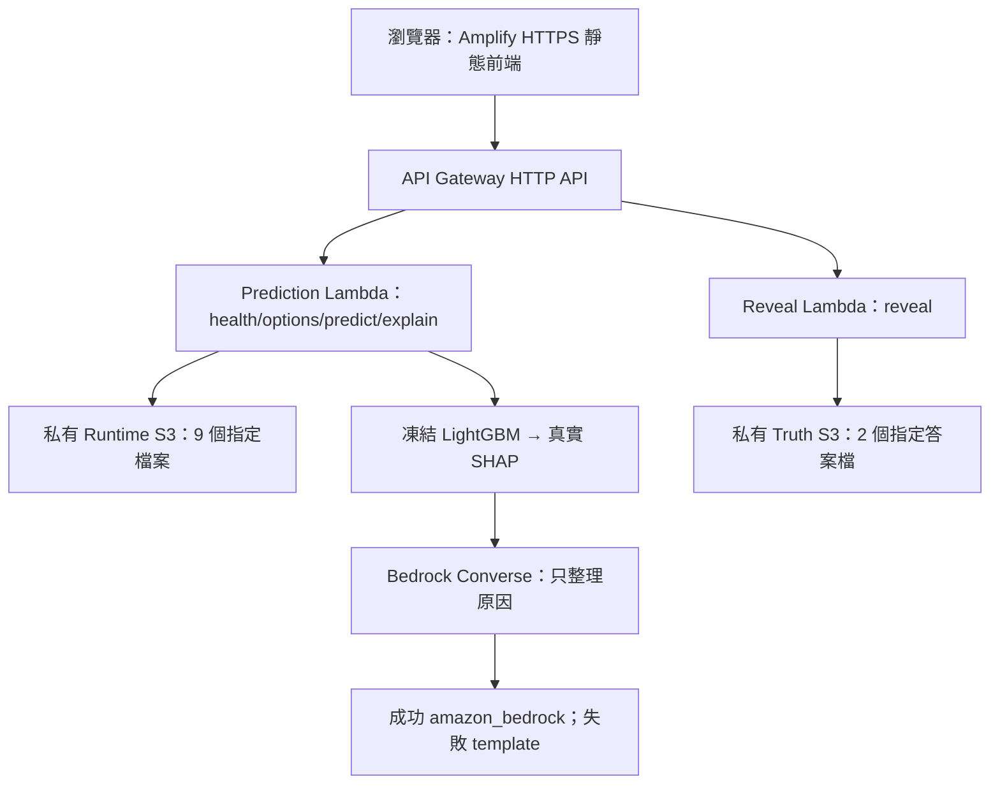

> 保留的部署階段規格；個人路徑已移除。舊授權與期限描述為當時紀錄，目前版本請見 README 與 docs/STATE.md。

# Design — 沿用現有 AWS 路徑完成部署

日期：2026-09-12 更新。設計持續有效；本地 T0–T3 已完成，雲端仍未部署，詳見 STATE.md。
先讀 [requirements.md](../../../.kiro/specs/aws-demo-deployment/requirements.md) 與 [STATE.md](../../../docs/STATE.md)。

## D1｜固定入口與既有架構

白話：程式已經有上雲路徑，接手者只需把它完成，不另造一套 hosting。



| 檔案 | 接手用途 |
|---|---|
| infra/template.yaml | 兩個 Lambda、角色、兩個S3、HTTP API、Amplify、CloudWatch、參數 |
| Dockerfile.aws／requirements-aws.txt | Python3.12 Linux x86_64 容器、libgomp及native import檢查 |
| scripts/deploy-aws.ps1 | SAM build/deploy、11檔上傳、前端封裝、Amplify部署、基本驗收 |
| scripts/package-frontend.ps1 | 將實際 HTTPS ApiBaseUrl 編入靜態網站，產生ZIP及檢查 |
| scripts/verify-cloud.ps1 | 兩模式 API／SHAP／reveal／摘要／正向CORS；選用本地機率比對 |
| scripts/cleanup-aws.ps1 | 具名stack清理預覽及有旗標的刪除；不是離線命令 |
| backend/s3_assets.py | 固定key、bytes、hash allow-list；runtime9檔／truth2檔 |
| backend/bedrock_summary.py | 受控Converse、驗證輸出、template fallback；T1修改點 |
| backend/lambda_handler.py | payload2.0、stage normalization、角色分流；保留既有修補 |
| frontend/app/page.tsx | 雙模式、SHAP、reveal、派車示意；T2只改一處措辭 |
| .github/workflows/ci.yml | 測試／靜態build／SAM／容器build的CI定義；存在不等於最新run成功 |

Amplify 是 WEB＋manual deployment，EnableAutoBuild=false。本路徑不用 GitHub token、push 或新的 CI；amplify.yml 是連接Git時的替代buildspec，不是本次主入口。
不需要 SageMaker、EC2、ECS、RDS、Cloudflare／Sites 或 CDK 遷移。

### 現有預設

stack=ubikepredict-demo；region=us-east-1；stage=prod；release=frozen-v1；frontend branch=main。
Prediction memory=4096MB；Reveal=1536MB；Lambda timeout=25秒；/tmp=2048MB。
Bedrock預設off，timeout=6秒；S3 timeout=8秒；一般API3RPS/burst10，explain1RPS/burst1。
這些是目前repo值，主辦現行帳號／Region規則仍需確認。

## D2｜開工環境與基線保存

白話：同一台電腦的不同工具可能有不同 PATH 與檔案擁有者。先確認用到搬移後的程式。

以下在 repo PowerShell 執行；開工先建自己的證據子目錄，不覆蓋這輪的盤點資料：

```powershell
Set-Location -LiteralPath '<repository-root>'
$ErrorActionPreference = 'Stop'
$repoDir = (Get-Location).Path
$runStamp = Get-Date -Format 'yyyyMMdd-HHmmss'
$evidenceDir = Join-Path (Split-Path -Parent $repoDir) "aws-readiness\deploy-$runStamp"
New-Item -ItemType Directory -Path $evidenceDir -Force | Out-Null

git -c "safe.directory=$repoDir" rev-parse HEAD
git -c "safe.directory=$repoDir" status --short
git -c "safe.directory=$repoDir" stash list
git -c "safe.directory=$repoDir" diff --binary --output="$evidenceDir\preexisting.patch"

$env:PATH = '<local-sam-environment>/Scripts;' + $env:PATH
$env:SAM_CLI_TELEMETRY = '0'
Get-Command aws,sam,node,pnpm
& '.\.venv\Scripts\python.exe' --version
sam --version
```

2026-09-11這輪以user water執行git時曾遇dubious ownership；repo owner是CodexSandboxOffline。
僅對已核對的指定repo用上面的命令級 safe.directory，不要設定全域 safe.directory=*。
既有pnpm .bin啟動器保留部分舊NODE_PATH metadata；相對執行目標在新repo，本輪直接node執行lint及新repo dev流程通過。
若接手環境遇依賴路徑問題，使用凍結lockfile重新安裝前端依賴、重建shims；不要更新版本或回舊checkout工作。

Docker本輪未找到。GO後才按官方方式安裝／啟用Docker Desktop Linux backend；若需重開機或接受授權條款，交由使用者完成必要互動。
驗收要看到Server資訊與Linux，不只是CLI存在：

```powershell
Get-Command docker
docker version
docker info --format '{{.OSType}}'
.\scripts\smoke-test.ps1
Push-Location frontend
try { pnpm run lint } finally { Pop-Location }
.\scripts\deploy-aws.ps1 -Region us-east-1 -DryRun
sam build --template-file infra/template.yaml --build-dir .aws-sam/build --cached --parallel
```

sam build會下載映像／套件，但不建立AWS資源；使用Dockerfile.aws的native import gate。
不要拿現在的本地Windows import結果代替Linux容器結果。

## D3｜最小修補範圍

白話：修補只保證上雲穩定與文字正確，研究內容全部保留。

### Bedrock一次嘗試與回應時間

目前 backend/bedrock_summary.py:220 的 Config 使用 max_attempts=1；它允許首發之外再retry一次。
改為 retries={"total_max_attempts": 1, "mode": "standard"}，並保留錯誤轉template的行為。
[botocore官方定義](https://docs.aws.amazon.com/botocore/latest/reference/config.html) 明確區分兩者。

必要驗證在botocore HTTP transport層注入503、ReadTimeoutError／ConnectTimeoutError：
記錄實際send計數=1；一次失敗後回傳template，而非讓測試以FakeClient直接繞過SDK。
測試使用dummy credentials／本地transport，不能呼叫真Bedrock。既有有效／不合法JSON测试也要保留。

將這次Demo參數維持Bedrock6秒與Lambda25秒。對explain傳遞或檢查Lambda剩餘deadline，保留至少2秒回傳margin：
- 剩餘時間不足以完成本次connect＋read＋margin時，不呼叫Bedrock，直接template。
- 可以縮短read timeout，但不可設定非正數或把6秒提高來掩蓋延遲。
- 若S3／SHAP自身耗時已超出服務限制，視為另一個具體cloud失敗處理，不宣稱摘要guard能解決所有冷啟動。
- 本地API沒有Lambda context時沿用固定timeout；函式簽名與API回應保持相容。
- 預設6／25及「剩餘時間不足」都要驗證；不要宣稱尚未測過的全部合法timeout組合都安全。

允許碰觸：backend/bedrock_summary.py、必要的backend/api.py／lambda_handler.py deadline plumbing、對應 tests。
若需要frontend fallback原因顯示或MANIFEST中的程式hash更新，僅修改被實際影響條目；模型／config／data hash不變。
不引入新AI框架、不增加重試佇列／資料庫、不重設Lambda角色。

### 小幅展示文字

frontend/app/page.tsx目前有「歷史上自行恢復」，改成「歷史上30分鐘後已恢復」或同義表達。
用語不暗示當時無人介入；行動清單與模擬公式都不變。lint＋瀏覽器觀察足夠，不寫鏡像實作的文字測試。

## D4｜非機密設定與登入

白話：Kiro登入不等於AWS部署登入；profile存在也不等於有建立資源的權限。

下列資料寫入證據資料夾的 deployment-context.json（不含任何secret）：

```json
{
  "aws_profile": "<user confirms>",
  "expected_account_id": "<12-digit target account>",
  "region": "<organizer-approved region>",
  "stack_name": "ubikepredict-demo",
  "stage_name": "prod",
  "release_id": "frozen-v1",
  "frontend_branch": "main",
  "aws_spending_limit": "<user-specified amount and currency or organizer allowance>",
  "retain_until": "<local date/time with timezone>",
  "bedrock_model_or_profile_id": "<resolve after login>",
  "bedrock_resource_arns": [],
  "bedrock_timeout_seconds": 6,
  "organizer_constraints": "<region, IAM and rate-limit rules>",
  "go_received": false
}
```

本機能列出default、hackathon，僅代表名稱。優先使用使用者指定profile，不讀出credentials值。
若SSO設定已存在：

```powershell
$AwsProfile = '使用者確認的profile'
$AwsRegion = '主辦允許的region'
aws sso login --profile $AwsProfile
aws sts get-caller-identity --profile $AwsProfile --region $AwsRegion
```

只有使用SSO的profile才執行sso login；主辦短期憑證按其本機流程設定，包含必要Session Token，過期就由使用者更新。
STS取得的Account必須符合expected_account_id，不相符便停止雲端動作。
不要把完整環境變數、credentials檔、pre-signed URL、Authorization header放進log。

部署身份需要建立／更新CloudFormation、Lambda、HTTP API、S3、ECR、Amplify、IAM roles/policies與iam:PassRole、CloudWatch Logs及資產上傳權限。
腳本沒有CloudFormation execution role參數，不能假設僅有Bedrock權限即可部署。
sam deploy的resolve-s3／resolve-image-repos也會使用SAM管理的封裝bucket／ECR repo；一併盤點費用與owner，不能粗暴清掉帳號共用資源。

Region、SCP、模型權限、Marketplace條件等無法靠本機文件保證。依帳號實際error及主辦規範處理，不自行接受新的付費模型訂閱或放寬安全限制。
僅配置預算警示不能保證硬停止；請求與資源數量維持Demo範圍，保存可追蹤清理清單。

## D5｜部署路徑與Bedrock接通

白話：先把同一套預測搬上去，再打開摘要；若後者失败，已知模型與網站正常，排錯會比較直接。

### Phase A：核心AWS＋template

完成T0～T4的前置、修補、容器檢查、GO及帳號／預算核對後：

```powershell
.\scripts\deploy-aws.ps1 -StackName ubikepredict-demo -Region $AwsRegion -Profile $AwsProfile
```

第一次不要加SkipAssetUpload／SkipFrontend／SkipVerify。
腳本會lint → STS → SAM build → deploy →11檔S3上傳 →以真ApiBaseUrl重建前端 →Amplify create/start/wait →API驗收。
sam deploy使用no-confirm-changeset：執行此命令就是建立／更新資源，不能當作預覽。

保存stack outputs：ApiBaseUrl、FrontendUrl、RuntimeBucketName、TruthBucketName、PredictionFunctionName、RevealFunctionName、AmplifyAppId。模板沒有role outputs；用 aws lambda get-function-configuration --profile $AwsProfile --region $AwsRegion --function-name '實際PredictionFunctionName' --query Role --output text 取得真execution-role ARN；Reveal同法。不要猜role名稱，也不需為此改template。
從Phase A第一次自動驗收開始保留API呼叫順序／UTC時間與對應CloudWatch INIT_START、INIT_REPORT（若有）、REPORT的Init Duration／Duration；deploy內建驗收會暖機，T7不能把任意兩次普通請求直接稱cold/warm。
以同一stack name處理可重入更新，不因錯誤反覆新建不同stack；ROLLBACK_COMPLETE等狀態要看events再決定，不自動刪除重建。

### Phase B：確認model與精確IAM，再啟用

先只讀確認可用model／profile，選擇支援現有Converse參數的模型。沒有指定就優先符合主辦規則的單Region選项；若使用cross-Region profile，要确认所有目的Region也被允許。

```powershell
aws bedrock get-inference-profile --profile $AwsProfile --region $AwsRegion --inference-profile-identifier '已核對的profile-id' --query '{profile:inferenceProfileArn,models:models[*].modelArn}'
```

這個get命令只適用inference profile；direct foundation model使用對應官方模型資料查ARN。
IAM清單包括精確profile ARN及必要目的foundation-model ARNs；Global profile按官方文件補齊regional／global ARN，不得猜測或用wildcard。

```powershell
$BedrockResourceArns = @(
  '已核對的精確ARN'
)
.\scripts\deploy-aws.ps1 -StackName ubikepredict-demo -Region $AwsRegion -Profile $AwsProfile -EnableBedrock -BedrockModelId '已確認的model或profile-id' -BedrockModelResourceArns $BedrockResourceArns -BedrockTimeoutSeconds 6
```

EnableBedrock會讓內建驗收要求provider=amazon_bedrock。若fallback，查fallback_reason及CloudWatch，不改成硬編碼amazon_bedrock。
真正成功後才更新投影片的AWS已完成說法。失敗回復template可維持展示，但交付狀態仍是Bedrock待完成。

## D6｜驗收設計

白話：自動腳本能確認很多事，但不能代替真正的網頁操作、IAM拒絕與冷啟動觀察。

本機API用新repo的python啟動，確認8000未被別人占用；正式API保留當次實際網址。

```powershell
# 另一個終端；需要GUI前端時可用scripts/start-local-app.ps1
& '.\.venv\Scripts\python.exe' -m backend.api

# 驗收終端；FrontendUrl須為真正的HTTPS origin
.\scripts\verify-cloud.ps1 -StackName ubikepredict-demo -Region $AwsRegion -Profile $AwsProfile -Origin '實際FrontendUrl' -LocalBaseUrl http://127.0.0.1:8000 -RequireBedrock
```

Phase A省略RequireBedrock；Phase B必須加。
LocalBaseUrl未傳就不會做cloud/local parity。完整兩模式已知案例預期見R2；本次固定允許機率誤差2e-7，不自行放大。
內建verify有正向CORS、頁面HTTP200與YouBike文字檢查，沒有執行瀏覽器JavaScript。

額外驗收矩陣：

| 檢查 | 操作及成功證據 |
|---|---|
| 真實瀏覽器 | 正式網址predict、點站SHAP、reveal、換模式／政策、派車示意；另一裝置或無痕；保存截圖與步驟結果 |
| IAM deny | 同Prediction execution role嘗試對兩個truth key做GetObject，兩次AccessDenied；同role一個runtime key讀取成功作對照 |
| Reveal權限 | 正常reveal成功；檢視effective policy只含指定truth objects；若額外實測跨runtime拒絕，以同方法另記 |
| CORS | 正式Origin取得精確ACAO；https://not-allowed.invalid不取得允許该來源的ACAO；不要求任意HTTP code必為403 |
| 節流 | Phase A先讀實際stage/route設定，再最多6個小請求、併發至多2觀察429；不開無限重試／大型壓測；有結果才聲稱行為已觀察 |
| Cold/warm | 從T5／T6部署自動驗收的第一個invoke保存HTTP結果、UTC時間及CloudWatch INIT/REPORT耗時；以實際Init Duration確認冷啟動，再記暖呼叫。T7檢閱這些證據，不能把已暖機的兩次呼叫假標為cold/warm；若未捕捉到，就列未驗並安排受控驗證 |
| Fallback | 本地SDK注入timeout/503已過；雲端可透過明確的Bedrock-off部署驗證template仍可操作，再恢复Bedrock-on並驗真provider；不擴權或破壞其他服務來造失敗 |
| 資產完整 | S3 keys／version／bytes／SHA比對；hash錯誤不能改manifest讓它過 |
| Demo語義 | 預測不讀答案；reveal是公開回放；SHAP不是因果；派車結果是条件上限 |

### 實際IAM診斷方法

現有API沒有任意讀S3的入口，不要新增公開診斷後門。
GO包含本spec有限驗收資源時，可建立**一個臨時、無API入口的Python Lambda**，沿用Prediction execution role，使用SDK依序：
讀取一個指定runtime object（只記成功及bytes，不回內容）；以Range bytes=0-0嘗試兩個指定truth objects，捕捉AccessDenied，只回key標籤與error code。
最多一次正常invoke及一次排錯重試；保留request ID與結果，隨即刪除這個具名probe。用獨立且不撞名的run suffix／專案tag，記錄exact ARN。
不修改Production function、不擴大role、不加入任何公開路由，也不把答案內容寫入log。
若主辦禁止此臨時函式／PassRole，先用IAM simulator作部分證據，並明確標「實際deny未驗證」；無法完成的驗收報出原因，不偽稱全部完成。
對既有或非本次的资源不適用probe清理授權。

官方注意：[HTTP API CORS](https://docs.aws.amazon.com/apigateway/latest/developerguide/http-api-cors.html) 是瀏覽器規則；
[HTTP API節流](https://docs.aws.amazon.com/apigateway/latest/developerguide/http-api-throttling.html) 是best-effort。
若硬性全域Bedrock速率要求無法用現有架構滿足，停止該部分，帶回具體需求與最小替代方案，不能暗增新服務。

## D7｜失敗、恢復與清理

| 狀況 | 下一步 |
|---|---|
| Docker缺失／不是Linux | 完成官方安裝與daemon檢查；不先部署半套 |
| import失敗 | 根據容器錯誤修Docker依賴；保留libgomp，不改模型 |
| STS無效／過期 | 使用者完成本機登入／refresh；先前profile名稱不是權限證據 |
| CloudFormation denied | 保存精確action/resource與stack event，請帳號管理者授權必要範圍；不自動加AdministratorAccess |
| Bedrock denied／參數不支援 | 查model/profile/Region/SCP／Converse支援；保留template，不更改risk或偽裝provider |
| S3 hash mismatch | 比較本地與上傳key/version並更正上傳；不改凍結hash |
| parity超標 | 核對feature順序、model/config hash、runtime版本；不調門檻讓結果「接近」 |
| Cloud頁面但API失敗 | 查編入的ApiBaseUrl、CORS、網路與Lambda logs，不能回退localhost |
| 預算／主辦限制不明 | 本地工作繼續；暫停新增雲端資源或付費呼叫，集中索取缺的資料 |

以同一stack／同一服務恢復前一個已驗收的映像與配置；修補前保存artifact與非機密部署設定。
需要暫時關閉Bedrock時，用同一部署腳本不加EnableBedrock，驗provider=template；避免以手動console修改造成無紀錄的drift。

清理預览会读取AWS Describe/Tag APIs，但不刪除：

```powershell
.\scripts\cleanup-aws.ps1 -StackName ubikepredict-demo -Region $AwsRegion -Profile $AwsProfile
```

只有取得對該具名stack及bucket版本內容的明確清理授權後才執行：

```powershell
.\scripts\cleanup-aws.ps1 -StackName ubikepredict-demo -Region $AwsRegion -Profile $AwsProfile -Execute -DeleteBucketContents
```

先核對resolved資源、tag與ownership；不要刪其他stack、SAM共用封裝bucket／ECR repo或這台電腦的資料。
保留期限是待辦紀錄，不是自動刪除／提醒授權；這份spec不新增排程。
