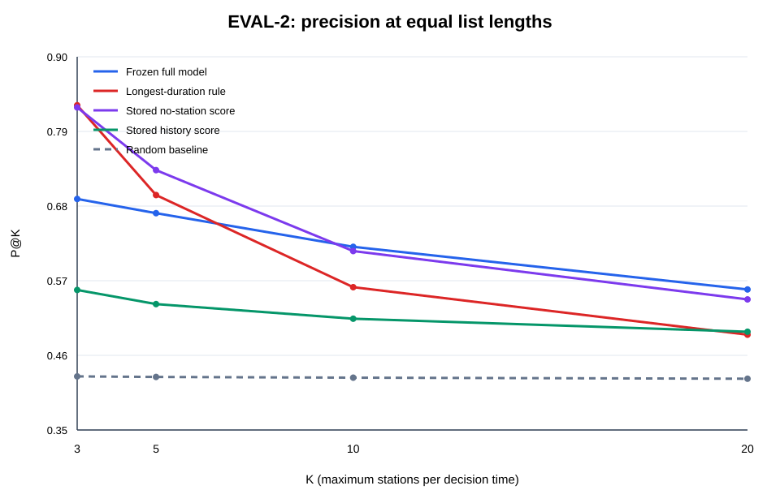
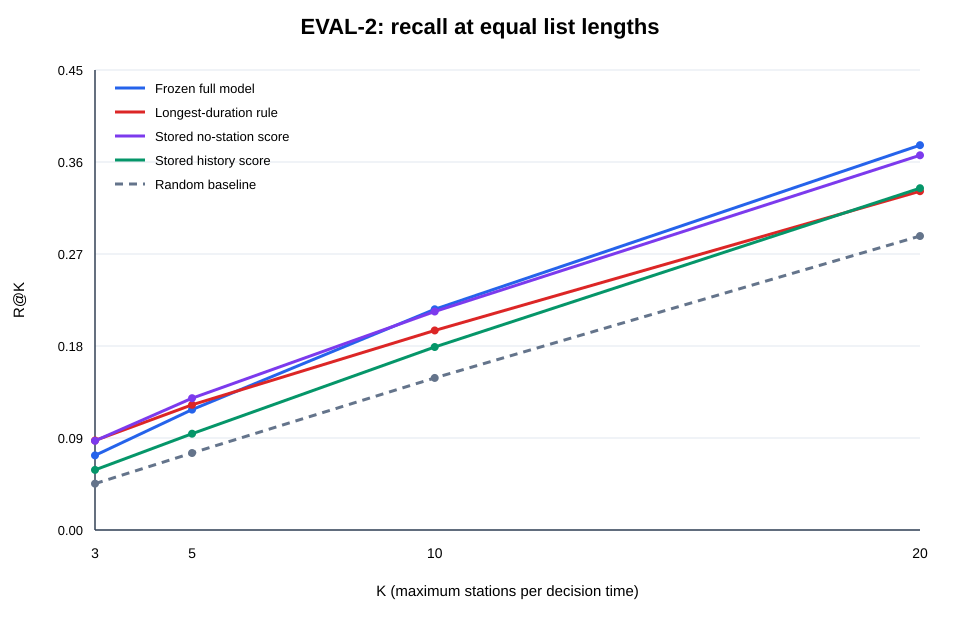
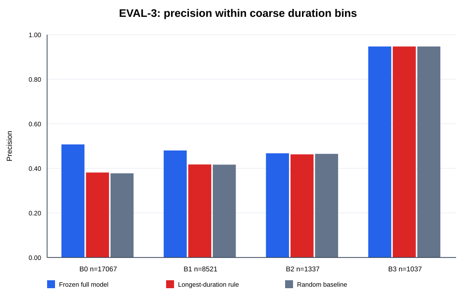
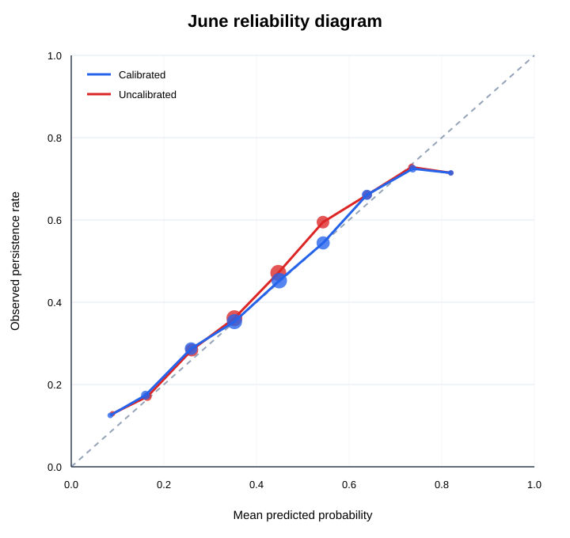

# YouBike EVAL-2～4 正式回溯評估

- Run ID：`20260911_r2_0_provenance_v2`
- Git commit：`21e5ea52a7759ca2365975140e9b4800d1b8dd4b`
- 完成狀態：EVAL-2 完成；EVAL-3 完成並加做 exact-duration 診斷；EVAL-4 完成；EVAL-1 不在本次範圍且缺訓練材料。
- F0 parity：27,962 筆與 frozen reference 的最大絕對機率差為 `0`。
- 母體流量：truth-free source 92,882 筆 → peak 33,465 筆 → 排除未知起點 5,503 筆 → eligible 27,962 筆；所有 target 都是決策時間後 30 分鐘。

## 一分鐘結論

1. **模型的優勢依名單容量而變。** 固定規則下，F0 相較「缺車最久」的 P@K 差異為 K=3: -13.81pp, K=5: -2.67pp, K=10: +5.95pp, K=20: +6.67pp。小名單 K=3／5 並沒有支持完整模型全面勝出；K=10／20 才由完整模型領先。
2. **模型的額外排序價值主要在較早期缺車。** 粗分組結果要搭配 exact-duration 診斷閱讀；B3 長事件本身正例率很高，不代表模型提供同等資訊增益。
3. **Platt 校正小幅改善整體 loss／ECE，且讓樣本最多的 0.3～0.6 三個機率區間更接近實際比例；並非每個區間都改善。** 最高機率區樣本很少（校正後 0.8 以上共 56 筆），不可只看最高區間下強結論。

這些結果都是已開封六月資料上的回溯／探索性診斷，不能宣稱為新的盲測、未來泛化或實際調度的因果效果。

## EVAL-2：相同名單長度比較

| K | 方法 | 入選 | P@K | R@K | AP |
|---|---|---|---|---|---|
| 3 | Frozen full model | 1260 | 69.05% | 7.30% | 0.5661 |
| 3 | Longest-duration rule | 1260 | 82.86% | 8.76% | 0.5142 |
| 3 | Stored no-station score | 1260 | 82.54% | 8.72% | 0.5865 |
| 3 | Stored history score | 1260 | 55.63% | 5.88% | 0.5058 |
| 3 | Random baseline | 1260 | 42.90% (40.00%–46.27%) | 4.53% | 0.4268 |
| 5 | Frozen full model | 2097 | 66.95% | 11.78% | 0.5661 |
| 5 | Longest-duration rule | 2097 | 69.62% | 12.25% | 0.5142 |
| 5 | Stored no-station score | 2097 | 73.30% | 12.89% | 0.5865 |
| 5 | Stored history score | 2097 | 53.55% | 9.42% | 0.5058 |
| 5 | Random baseline | 2097 | 42.82% (40.63%–45.49%) | 7.53% | 0.4268 |
| 10 | Frozen full model | 4152 | 61.99% | 21.59% | 0.5661 |
| 10 | Longest-duration rule | 4152 | 56.05% | 19.52% | 0.5142 |
| 10 | Stored no-station score | 4152 | 61.37% | 21.37% | 0.5865 |
| 10 | Stored history score | 4152 | 51.40% | 17.90% | 0.5058 |
| 10 | Random baseline | 4152 | 42.71% (40.80%–44.20%) | 14.88% | 0.4268 |
| 20 | Frozen full model | 8056 | 55.71% | 37.65% | 0.5661 |
| 20 | Longest-duration rule | 8056 | 49.04% | 33.14% | 0.5142 |
| 20 | Stored no-station score | 8056 | 54.25% | 36.66% | 0.5865 |
| 20 | Stored history score | 8056 | 49.48% | 33.44% | 0.5058 |
| 20 | Random baseline | 8056 | 42.55% (41.68%–43.37%) | 28.76% | 0.4268 |

隨機方法括號為 100 seeds 的最小到最大 P@K。`STORED_NO_STATION` 與 `STORED_HISTORY` 只有保存分數，沒有對應模型／歷史表，因此只能作保存分數評估，不能稱為本機重新推論。K=10 的 F0 與 duration 數字完全重現既有 E22。

Duration 同分隨機化敏感度（100 seeds）：

| K | 平均 P@K | 最小 | 最大 |
|---|---|---|---|
| 3 | 82.41% | 81.67% | 83.25% |
| 5 | 69.40% | 68.67% | 70.10% |
| 10 | 56.12% | 54.99% | 56.89% |
| 20 | 48.83% | 48.14% | 49.28% |

K=10 的成對按日 bootstrap：F0 − DURATION = `5.95pp`，95% 區間 `[3.78, 8.13]pp`，有效抽樣 `2000`／`2000`。這只反映 30 個六月日期的抽樣變動，沒有解決跨日 episode 相關或多重比較問題。

## EVAL-3：模型是否只靠長時間缺車？

### 表 A：拆開原本全市 Top-10

| 時長組 | 候選/正例 | 方法 | 入選 | 入選占比 | Precision | 組內 Recall |
|---|---|---|---|---|---|---|
| B0 | 17,067/6,651 | Frozen full model | 2105 | 50.70% | 55.96% | 17.71% |
| B0 | 17,067/6,651 | Longest-duration rule | 237 | 5.71% | 37.13% | 1.32% |
| B0 | 17,067/6,651 | Random baseline | 2513 | 60.53% | 37.67% | 14.24% |
| B1 | 8,521/3,664 | Frozen full model | 1144 | 27.55% | 56.56% | 17.66% |
| B1 | 8,521/3,664 | Longest-duration rule | 1751 | 42.17% | 41.86% | 20.01% |
| B1 | 8,521/3,664 | Random baseline | 1198 | 28.87% | 42.02% | 13.74% |
| B2 | 1,337/624 | Frozen full model | 279 | 6.72% | 58.42% | 26.12% |
| B2 | 1,337/624 | Longest-duration rule | 1127 | 27.14% | 46.50% | 83.97% |
| B2 | 1,337/624 | Random baseline | 207 | 4.99% | 48.45% | 16.09% |
| B3 | 1,037/982 | Frozen full model | 624 | 15.03% | 93.91% | 59.67% |
| B3 | 1,037/982 | Longest-duration rule | 1037 | 24.98% | 94.70% | 100.00% |
| B3 | 1,037/982 | Random baseline | 233 | 5.61% | 95.46% | 22.66% |

這張表保留原本全市最多 10 站的名單，因此可以看不同方法把名額放在哪些時長；但各組入選數不同，不能只靠組內 precision 判定方法勝負。

### 表 B：在相同粗時長區間內各取最多 10 站

| 時長組 | 候選/正例 | >10 時點 | 方法 | 入選 | Precision | 組內 Recall |
|---|---|---|---|---|---|---|
| B0 | 17,067/6,651 | 369 | Frozen full model | 4020 | 50.75% | 30.67% |
| B0 | 17,067/6,651 | 369 | Longest-duration rule | 4020 | 38.13% | 23.05% |
| B0 | 17,067/6,651 | 369 | Random baseline | 4020 | 37.76% | 22.83% |
| B1 | 8,521/3,664 | 283 | Frozen full model | 3612 | 48.03% | 47.35% |
| B1 | 8,521/3,664 | 283 | Longest-duration rule | 3612 | 41.75% | 41.16% |
| B1 | 8,521/3,664 | 283 | Random baseline | 3612 | 41.66% | 41.07% |
| B2 | 1,337/624 | 19 | Frozen full model | 1240 | 46.77% | 92.95% |
| B2 | 1,337/624 | 19 | Longest-duration rule | 1240 | 46.29% | 91.99% |
| B2 | 1,337/624 | 19 | Random baseline | 1240 | 46.51% | 92.43% |
| B3 | 1,037/982 | 0 | Frozen full model | 1037 | 94.70% | 100.00% |
| B3 | 1,037/982 | 0 | Longest-duration rule | 1037 | 94.70% | 100.00% |
| B3 | 1,037/982 | 0 | Random baseline | 1037 | 94.70% | 100.00% |

表 B 是診斷政策，一個時刻最多可能選 4×10 站，不能與表 A 的全市 K=10 當成同一營運政策。B3 是 `steps≥6` 的寬區間，仍可能殘留時長差異。

Duration 同分規則在 EVAL-3 的敏感度：

| 面板 | 時長組 | 固定 ID Precision | 隨機同分平均 | 隨機同分範圍 |
|---|---|---|---|---|
| 全市 Top-10 | B0 | 37.13% | 37.04% | 30.80%–43.46% |
| 全市 Top-10 | B1 | 41.86% | 42.27% | 40.03%–44.09% |
| 全市 Top-10 | B2 | 46.50% | 46.14% | 45.34%–46.76% |
| 全市 Top-10 | B3 | 94.70% | 94.70% | 94.70%–94.70% |
| 粗時長組內 Top-10 | B0 | 38.13% | 37.76% | 36.42%–39.58% |
| 粗時長組內 Top-10 | B1 | 41.75% | 42.35% | 41.11%–43.38% |
| 粗時長組內 Top-10 | B2 | 46.29% | 46.38% | 45.65%–46.94% |
| 粗時長組內 Top-10 | B3 | 94.70% | 94.70% | 94.70%–94.70% |

### Exact-duration 補充診斷

為避免粗分組誤稱已完全控制時長，另在每個 `(datetime, red_duration_steps)` 內，計算模型把正例排在負例前面的成對比例；0.5 相當於沒有區辨力。

| 時長組 | 可比較群組 | 正負例配對 | Conditional AUC | 按日 bootstrap 95% CI |
|---|---|---|---|---|
| ALL | 1283 | 270495 | 0.6251 | [0.6176, 0.6335] |
| B0 | 413 | 227649 | 0.6317 | [0.6236, 0.6404] |
| B1 | 666 | 41734 | 0.5904 | [0.5753, 0.6084] |
| B2 | 199 | 1104 | 0.5870 | [0.5365, 0.6372] |
| B3 | 5 | 8 | 0.6250 | [0.3333, 1.0000] |

這是以正負例配對數加權的 conditional AUC，不是 K=10 precision；全部配對中有 **84.16%** 來自 B0，而 B3 只有 8 對，因此整體值主要反映剛觀察到缺車的站，B3 不足以下結論。

## EVAL-4：機率校正

| 分數 | Brier | Log loss | 校正截距 | 校正斜率 | 等寬 ECE |
|---|---|---|---|---|---|
| prevalence_baseline | 0.244573 | 0.682253 | NA | NA | 0.0000 |
| uncalibrated | 0.229041 | 0.649653 | 0.1218 | 1.0608 | 0.0228 |
| calibrated | 0.228518 | 0.648643 | 0.0153 | 0.9466 | 0.0081 |

Brier／log loss 越低越好；理想校正截距為 0、斜率為 1。固定十個等寬區間是主任務；模型分數另保存十等分 quantile bins 作敏感度參考。每區 Wilson 95% 區間是逐列描述性區間，未作 episode／日期叢集校正。沒有在六月重新擬合校正器。

校正後 − 校正前的成對按日 bootstrap（負值代表校正後 loss 較低）：

| 指標 | 差異 | 95% CI |
|---|---|---|
| brier | -0.000523 | [-0.000848, -0.000194] |
| log_loss | -0.001010 | [-0.001687, -0.000322] |

## 重要限制

- 六月已在既有研究與 E22 中被查看，本次不能當全新 holdout。
- 標籤是「30 分鐘後仍 exact-zero」，不是調度介入的因果成功率。
- eligible 母體要求 target 快照有效、營運中且容量相同，因此不能直接代表線上所有紅燈站。
- 同一 episode 可每 30 分鐘重複出現；按日 bootstrap 只部分處理相依性。
- 多個 K、方法與時長組屬探索性比較；不要從其中挑最好的一格宣稱確證性顯著。
- Table B 的粗時長 bin 不能完全控制 duration，因此同時交付 exact-duration conditional AUC。

## 可重現檔案

- `metrics.csv`：所有逐 seed 與彙總所需指標。
- `predictions.parquet`：F0、duration 與兩種保存分數的逐列評分資料。
- `selections.parquet`：EVAL-2／3 的逐列入選名單。
- `random_priorities.parquet`：100 seeds 對每列的固定隨機優先值。
- `calibration_bins.csv`、`eval4_scores.csv`：校正明細。
- `run_manifest.json`：hash、版本、參數與執行狀態。
- `commands.md`、`logs/run.log`：實際命令與紀錄。
